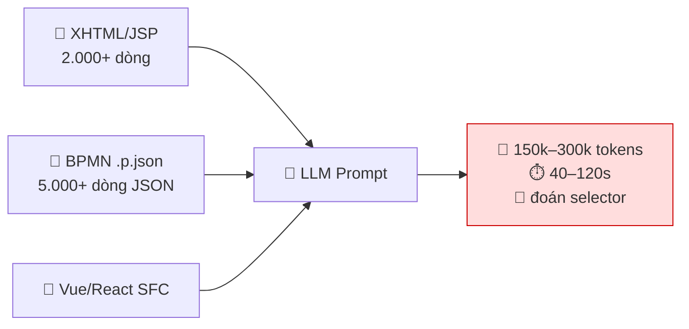
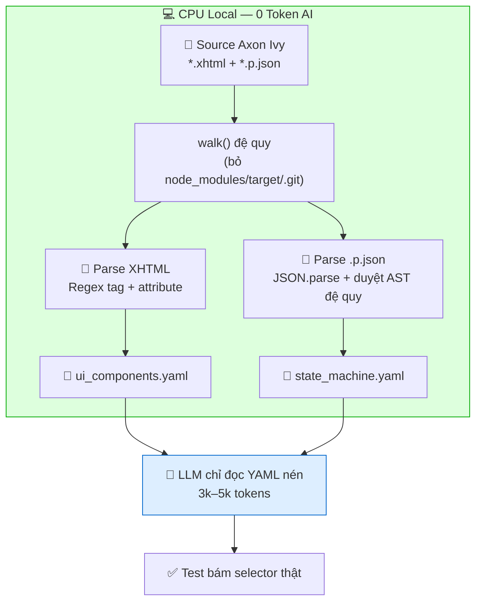
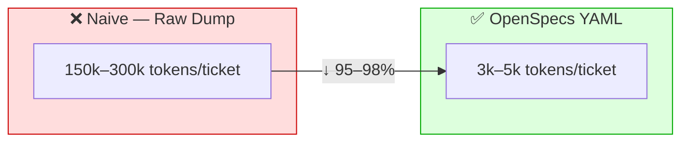
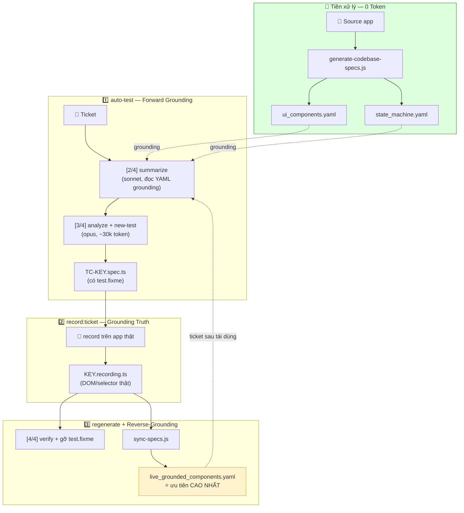

# 🏛️ Kiến Trúc OpenSpecs YAML — Vì Sao Nén Codebase Thành YAML Lại Nhanh, Nhẹ & Tiết Kiệm Token

> **Tài liệu trình bày nội bộ (team engineer) & lãnh đạo.**
> Giải thích cơ chế bóc tách mã nguồn ứng dụng (XHTML / BPMN `.p.json`) thành bộ đặc tả YAML (`ui_components.yaml`, `state_machine.yaml`) để GitHub Copilot "grounding" chính xác 100% — thay vì nạp thô mã nguồn vào LLM.
>
> Áp dụng cho dự án **QA-Playwright-ASAP** (Axon Ivy + PrimeFaces/JSF).

---

## 📑 Mục Lục

1. [TL;DR — Tóm tắt cho lãnh đạo](#1-tldr--tóm-tắt-cho-lãnh-đạo)
2. [Vấn đề: nạp mã nguồn thô vào LLM đắt & thiếu chính xác](#2-vấn-đề-nạp-mã-nguồn-thô-vào-llm-đắt--thiếu-chính-xác)
3. [Giải pháp: Zero-Token Preprocessing (bóc tách tĩnh trên CPU local)](#3-giải-pháp-zero-token-preprocessing-bóc-tách-tĩnh-trên-cpu-local)
4. [Cấu trúc `ui_components.yaml`](#4-cấu-trúc-ui_componentsyaml)
5. [Cấu trúc `state_machine.yaml`](#5-cấu-trúc-state_machineyaml)
6. [Vì sao YAML thắng JSON & Raw Code](#6-vì-sao-yaml-thắng-json--raw-code)
7. [Benchmark & Kinh tế học Token](#7-benchmark--kinh-tế-học-token)
8. [Vị trí trong quy trình 3 bước Grounding & Reverse-Grounding](#8-vị-trí-trong-quy-trình-3-bước-grounding--reverse-grounding)
9. [Kết luận](#9-kết-luận)

---

## 1. TL;DR — Tóm Tắt Cho Lãnh Đạo

| Chỉ số | Nạp mã nguồn thô (naive) | OpenSpecs YAML (kiến trúc này) | Cải thiện |
| --- | --- | --- | --- |
| **Token đầu vào / ticket** | 150.000 – 300.000 tokens | 3.000 – 5.000 tokens | **↓ 95 – 98%** |
| **Chi phí AI / ticket** | ~$2.00 – $4.00 | ~$0.03 – $0.05 | **↓ ~98%** |
| **Độ trễ (latency)** | 40 – 120 giây (nhiều turn) | 3 – 8 giây (1 turn) | **~10 – 20× nhanh hơn** |
| **Rủi ro "ảo giác" selector** | Cao (AI đoán DOM) | Gần như bằng 0 (grounding thật) | **Loại bỏ hallucination** |
| **Vượt giới hạn context window** | Thường xuyên (>128k) | Không bao giờ | **An toàn 100%** |

> **Ý tưởng cốt lõi:** LLM **không cần đọc toàn bộ mã nguồn** để hiểu ứng dụng. Ta dùng **CPU local (0 token AI)** để bóc tách *đúng phần tri thức cần thiết* — id component, label, role, transition — nén thành YAML dày đặc ngữ nghĩa. LLM chỉ đọc bản nén này.

---

## 2. Vấn Đề: Nạp Mã Nguồn Thô Vào LLM Đắt & Thiếu Chính Xác

Cách làm ngây thơ (naive) khi muốn AI sinh test cho một màn hình: **dán cả file XHTML/JSP/Vue/React + BPMN `.p.json` vào prompt**.

### 2.1. Ba nút thắt cổ chai (bottleneck)



| Nút thắt | Cơ chế đốt token | Hậu quả |
| --- | --- | --- |
| **Full Source Dump** | Mỗi màn hình = hàng nghìn dòng markup + binding EL + CSS + comment vô nghĩa với AI. | Chạm rate limit, cháy quota model. |
| **Nhiễu cú pháp (syntax noise)** | 60–80% ký tự là `<div>`, `</div>`, `"`, `{`, `}`, thuộc tính style — **không mang ngữ nghĩa nghiệp vụ**. | Token/ngữ-nghĩa cực thấp → trả tiền cho rác. |
| **Multi-turn trial & error** | AI đoán sai selector → chạy fail → gửi lại DOM → lặp 5–10 lượt. | Token nhân theo cấp số nhân cho 1 test case. |

### 2.2. Vì sao AI "ảo giác" (hallucinate)

Khi bị nhồi 300k tokens markup thô, LLM phải **tự suy ra** đâu là `id` thật của nút "Save", trường nào bắt buộc, role nào thấy được màn hình. Kết quả: AI **bịa** `getByRole('button', { name: 'Save' })` trong khi id thật là `form:saveBtn` — test **fail ngay lần đầu** (xem `docs/ROOT_CAUSE_ANALYSIS_TESTCASE_VS_PROMPT.md`, nguyên nhân R1).

---

## 3. Giải Pháp: Zero-Token Preprocessing (Bóc Tách Tĩnh Trên CPU Local)

Thay vì đốt context window của LLM để "đọc hiểu" mã nguồn, ta chuyển việc đọc-hiểu sang **CPU local qua phân tích tĩnh (Static AST / Regex)** — **0 token AI**.

`scripts/generate-codebase-specs.js` quét **READ-ONLY** mã nguồn và bóc tách:



### 3.1. Bóc tách XHTML — Regex trên tag/attribute

Script duyệt các tag PrimeFaces/JSF đã biết và ánh xạ về loại component chuẩn hoá:

```js
// scripts/generate-codebase-specs.js
const COMPONENT_TAG_MAP = {
  'p:selectBooleanCheckbox': 'selectBooleanCheckbox',
  'p:inputText': 'inputText',
  'p:commandButton': 'commandButton',
  'p:selectOneMenu': 'selectOneMenu',
  'p:calendar': 'datePicker',
  // ...
};
```

Với mỗi tag khớp, nó rút ra **chỉ những gì AI cần**: `id`, `type`, `label` (ưu tiên `ivy.cms.co('/path')` → key CMS ngắn gọn), `valueBinding`, `actionBinding`, `rendered`, và **suy luận `required`** bằng cách nhìn 400 ký tự phía sau tìm `requiredCheckboxValidator` / `required="true"`.

> **Điểm mấu chốt:** 2.000 dòng XHTML → còn vài chục dòng YAML mang **đúng ngữ nghĩa nghiệp vụ**, vứt bỏ toàn bộ layout/CSS/comment.

### 3.2. Bóc tách BPMN `.p.json` — AST đệ quy

Process Axon Ivy lồng nhau qua `EmbeddedProcessGroup` / `SubProcess`. Hàm `collectProcessElements()` **duyệt đệ quy toàn cây JSON** (một dạng AST walking) để gom:

- **`UserTask`** → `id`, `name`, `dialog`, `responsibleRole` (giải mã `ROLE_FROM_ATTRIBUTE(...)`).
- **`Alternative`** → transition + **điều kiện rẽ nhánh** (`conditions`).
- **`roles`** → tập hợp mọi vai trò xuất hiện trong process.

```js
if (el && el.type === 'UserTask') {
  tasks.push({
    id: el.id,
    name: rawName,
    dialog: (el.config && el.config.dialog) || null,
    responsibleRole   // ← đã giải mã ROLE_FROM_ATTRIBUTE
  });
} else if (el && el.type === 'Alternative') {
  transitions.push({ id: el.id, name: el.name, conditions });
}
// đệ quy vào sâu để bắt SubProcess lồng nhau
collectProcessElements(el, tasks, transitions, roles);
```

> **Không một token AI nào bị tiêu tốn** trong toàn bộ bước này. Đây là **phần đắt nhất** (đọc hiểu cả codebase) nhưng lại **rẻ nhất về chi phí** — vì chạy trên CPU, không phải trên GPU của nhà cung cấp LLM.

---

## 4. Cấu Trúc `ui_components.yaml`

Bản đặc tả UI tĩnh: **mỗi dialog/màn hình → danh sách component** với đầy đủ dữ kiện để grounding locator.

### 4.1. Sơ đồ cấu trúc

```
ui_components.yaml
├── generatedAt          # ISO timestamp lúc sinh
├── source               # đường dẫn source đã quét (READ-ONLY)
├── dialogCount          # tổng số dialog
├── componentCount       # tổng số component
└── dialogs[]
    ├── name             # tên dialog (= tên file .xhtml)
    ├── path             # đường dẫn tương đối trong source
    ├── componentCount
    └── components[]
        ├── id           # ⭐ id thật để dựng selector (form:saveBtn)
        ├── type         # loại chuẩn hoá (inputText, commandButton...)
        ├── tag          # tag gốc (p:inputText)
        ├── label        # nhãn hiển thị / key CMS
        ├── valueBinding # EL binding (#{bean.field})
        ├── actionBinding# action/actionListener
        ├── rendered     # điều kiện hiển thị (nếu có)
        ├── required     # ⭐ bắt buộc? (suy luận từ validator)
        └── styleClass
```

### 4.2. Ví dụ thực tế

```yaml
generatedAt: '2026-09-08T07:30:00.000Z'
source: D:\Projects\asap
dialogCount: 42
componentCount: 318
dialogs:
  - name: DeviceRegistrationDialog
    path: processes/Device/DeviceRegistrationDialog.xhtml
    componentCount: 4
    components:
      - id: form:stationNumber
        type: inputText
        tag: p:inputText
        label: /Dialogs/Device/StationNumber
        valueBinding: '#{data.device.stationNumber}'
        actionBinding: null
        rendered: null
        required: true
        styleClass: w-full
      - id: form:transformerCheckbox
        type: selectBooleanCheckbox
        tag: p:selectBooleanCheckbox
        label: nsTransformerMeasurementAvailable
        valueBinding: '#{data.device.nsTransformerMeasurementAvailable}'
        required: false
      - id: form:saveButton
        type: commandButton
        tag: p:commandButton
        label: /Buttons/Save
        actionBinding: '#{logic.save}'
        required: false
```

> Từ YAML này, Copilot biết chắc nút Save có id `form:saveButton`, trường `stationNumber` **bắt buộc** → sinh test đúng ngay lần đầu, không đoán.

---

## 5. Cấu Trúc `state_machine.yaml`

Bản đặc tả luồng nghiệp vụ (BPMN): **mỗi process → task, role phụ trách, transition + điều kiện rẽ nhánh**.

### 5.1. Sơ đồ cấu trúc

```
state_machine.yaml
├── generatedAt
├── source
├── processCount
├── taskCount
├── transitionCount
├── roles[]              # tổng hợp mọi role toàn hệ
└── processes[]
    ├── name
    ├── path
    ├── dataClass        # data class gắn với process
    ├── taskCount
    ├── transitionCount
    ├── tasks[]
    │   ├── id
    │   ├── name
    │   ├── dialog       # dialog gắn với task
    │   ├── taskNameExpr
    │   └── responsibleRole  # ⭐ ai được thao tác task này
    ├── transitions[]
    │   ├── id
    │   ├── name
    │   └── conditions   # ⭐ điều kiện rẽ nhánh (IvyScript)
    └── roles[]
```

### 5.2. Ví dụ thực tế

```yaml
generatedAt: '2026-09-08T07:30:00.000Z'
source: D:\Projects\asap
processCount: 12
taskCount: 47
transitionCount: 63
roles:
  - AssetManager
  - FieldTechnician
  - Reviewer
processes:
  - name: DeviceCommissioning
    path: processes/Device/DeviceCommissioning.p.json
    dataClass: com.asap.device.CommissioningData
    taskCount: 3
    transitionCount: 4
    tasks:
      - id: 15D2A1F0B3
        name: Enter device data
        dialog: DeviceRegistrationDialog
        taskNameExpr: /Tasks/EnterDeviceData
        responsibleRole: FieldTechnician
      - id: 15D2A1F0C7
        name: Review & approve
        dialog: DeviceReviewDialog
        responsibleRole: Reviewer
    transitions:
      - id: 15D2A1F0D9
        name: Approved?
        conditions: 'in.device.status == "READY"'
    roles:
      - FieldTechnician
      - Reviewer
```

> Copilot dùng file này để biết: task "Review & approve" **chỉ Reviewer** thao tác được, và rẽ nhánh Approved khi `status == "READY"` → sinh test đúng vai trò & đúng điều kiện.

---

## 6. Vì Sao YAML Thắng JSON & Raw Code

Cùng một tập ngữ nghĩa, ba định dạng tiêu tốn token **rất khác nhau**. Nguyên nhân: **mật độ ngữ nghĩa trên mỗi token** (token-to-semantic ratio).

### 6.1. So sánh trực quan cùng một component

**❌ Raw XHTML (~55 tokens, đầy nhiễu):**
```xml
<p:inputText id="stationNumber" value="#{data.device.stationNumber}"
             styleClass="w-full" required="true"
             requiredMessage="#{msg['error.required']}">
  <p:ajax event="blur" update="@this" />
</p:inputText>
```

**🟡 JSON (~38 tokens, nặng dấu ngoặc/nháy):**
```json
{ "id": "form:stationNumber", "type": "inputText", "required": true, "label": "StationNumber" }
```

**✅ YAML (~22 tokens, phân cấp bằng thụt lề):**
```yaml
- id: form:stationNumber
  type: inputText
  required: true
  label: StationNumber
```

### 6.2. Bảng so sánh định dạng

| Tiêu chí | Raw Code (XHTML/JSON app) | JSON | **YAML (đã chọn)** |
| --- | --- | --- | --- |
| **Nhiễu cú pháp** | Rất cao (`<>`, CSS, ajax, comment) | Trung bình (`{}`, `"`, `,`) | **Thấp nhất (thụt lề)** |
| **Ký tự dư/token** | `<div></div>`, quote kép | `{`, `}`, `"key":`, `,` | Gần như 0 (chỉ `-` và `:`) |
| **Biểu diễn phân cấp** | Tag lồng nhau dài dòng | Ngoặc lồng nhau | **Thụt lề tự nhiên** |
| **Mật độ ngữ nghĩa** | Thấp (20–40%) | Trung bình (~60%) | **Cao nhất (~90%)** |
| **LLM đọc dễ?** | Khó (phải bỏ nhiễu) | Ổn | **Rất dễ (train nhiều)** |
| **Token cho cùng dữ liệu** | 100% (mốc) | ~65% | **~40%** |

### 6.3. Vì sao thụt lề tiết kiệm token

- JSON lặp lại `"`, `{`, `}`, `,` ở **mọi** khóa → mỗi ký tự này thường là **1 token riêng**.
- YAML thay toàn bộ bằng **thụt lề (whitespace)** + `key:` — tokenizer gộp whitespace hiệu quả hơn nhiều so với chuỗi dấu ngoặc.
- Kết quả: cùng nội dung, YAML thường tốn **~60% token của JSON** và **~40% token của raw code**.

---

## 7. Benchmark & Kinh Tế Học Token

### 7.1. So sánh tiêu thụ token / ticket



| Hạng mục | Naive (Raw Dump) | OpenSpecs YAML | Tiết kiệm |
| --- | ---: | ---: | ---: |
| Token đầu vào / ticket | 150.000 – 300.000 | 3.000 – 5.000 | **95 – 98%** |
| Số turn tương tác | 5 – 10 (thử/sai) | 1 (one-shot) | **~90%** |
| Độ trễ end-to-end | 40 – 120 s | 3 – 8 s | **~10–20×** |
| Chi phí AI / ticket | **$2.00 – $4.00** | **$0.03 – $0.05** | **~98%** |
| Nguy cơ vượt context 128k | Cao | Không | Loại bỏ |
| Ảo giác selector | Thường xuyên | Gần như 0 | Loại bỏ |

### 7.2. Kinh tế học ở quy mô team

Giả sử team xử lý **500 ticket/tháng**:

| Kịch bản | Chi phí/ticket | Chi phí/tháng | Chi phí/năm |
| --- | ---: | ---: | ---: |
| Naive Raw Dump | $3.00 | **$1.500** | **$18.000** |
| OpenSpecs YAML | $0.04 | **$20** | **$240** |
| **Tiết kiệm** | | **$1.480/tháng** | **≈ $17.760/năm** |

> Chi phí bóc tách YAML là **một lần** (chạy `npm run generate-codebase-specs`, 0 token AI) và chỉ chạy lại khi codebase thay đổi. Phần "đắt" nhất được trả bằng **CPU local ~vài giây**, không phải bằng token LLM lặp lại mỗi ticket.

### 7.3. Giới hạn context window

- Model phổ biến: 128k – 200k token context. Một ticket phức tạp với vài file XHTML + `.p.json` **dễ dàng vượt** ngưỡng này → **không thể** nhét vừa.
- YAML nén cả màn hình + luồng nghiệp vụ xuống **3–5k token** → **luôn vừa**, còn thừa chỗ cho suy luận, ảnh, comment.

---

## 8. Vị Trí Trong Quy Trình 3 Bước Grounding & Reverse-Grounding

OpenSpecs YAML là **nền móng grounding** của toàn pipeline `npm run auto-test`.



### Ba bước chuẩn QA

| Bước | Lệnh | Vai trò của YAML |
| :-: | --- | --- |
| **1️⃣ Sinh test** | `npm run auto-test <KEY>` | `ui_components.yaml` + `state_machine.yaml` là **nguồn grounding** cho `/summarize-story` và `/new-test` → AI không đoán selector/role. |
| **2️⃣ Ghi hình** | `npm run record:ticket <KEY>` | Tester click flow thật → xuất recording (Grounding Truth ưu tiên cao hơn spec tĩnh). |
| **3️⃣ Regenerate** | `npm run regenerate <KEY>` | Spec bám selector thật, gỡ `test.fixme`; **Reverse-Grounding** merge selector đã kiểm chứng ngược vào `live_grounded_components.yaml` để **ticket sau tái dùng ngay**. |

### Grounding vs Reverse-Grounding

- **Forward (Grounding):** OpenSpecs YAML → sinh test. AI lấy id/label/role từ spec, không bịa.
- **Reverse-Grounding:** selector Tester vừa thao tác trên app thật → `sync-specs.js` bóc tách (`getByRole`, `getByLabel`, client-id `form:saveButton`...) → ghi vào `live_grounded_components.yaml` với `origin: live_recording_<KEY>`. File này **ưu tiên cao nhất** vì là DOM thật vừa quan sát → bộ spec **tự học, tích luỹ tri thức sống**.

---

## 9. Kết Luận

> **Nguyên lý:** *"Đừng bắt LLM đọc cả codebase. Hãy dùng CPU local (0 token) bóc tách đúng tri thức cần thiết, nén thành YAML dày đặc ngữ nghĩa, rồi chỉ đưa bản nén đó cho LLM."*

Kiến trúc OpenSpecs YAML mang lại đồng thời **3 lợi ích thường mâu thuẫn nhau**:

1. **💰 Rẻ:** ↓ 95–98% token → ~$0.04/ticket thay vì ~$3.00.
2. **⚡ Nhanh:** one-shot 3–8s thay vì multi-turn 40–120s.
3. **🎯 Chính xác:** grounding vào DOM/BPMN thật → loại bỏ ảo giác selector, test xanh ngay lần đầu.

Đây là sự dịch chuyển từ *"AI đọc hiểu mã nguồn thô mỗi lần"* sang *"tiền xử lý tĩnh một lần + AI suy luận trên bản nén"* — mô hình bền vững ở quy mô hàng trăm ticket/tháng.

---

### 🔗 Tài liệu liên quan

- [`README.md`](../README.md) — Quick Start 3 bước.
- [`docs/ADVANCED-GUIDE.md`](./ADVANCED-GUIDE.md) — cơ chế nâng cao.
- [`docs/QA_PLAYWRIGHT_OPTIMIZATION_PLAN.md`](./QA_PLAYWRIGHT_OPTIMIZATION_PLAN.md) — kế hoạch tối ưu token.
- [`docs/ROOT_CAUSE_ANALYSIS_TESTCASE_VS_PROMPT.md`](./ROOT_CAUSE_ANALYSIS_TESTCASE_VS_PROMPT.md) — vì sao grounding là bắt buộc.
- [`scripts/generate-codebase-specs.js`](../scripts/generate-codebase-specs.js) — bộ bóc tách.
- 🇬🇧 English version: [`docs/en/CODEBASE_YAML_SPECS_ARCHITECTURE.md`](./en/CODEBASE_YAML_SPECS_ARCHITECTURE.md)
