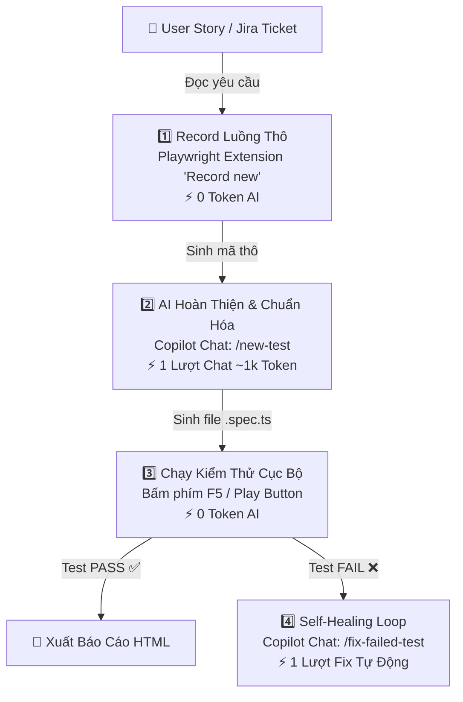

# 📋 KẾ HOẠCH TỐI ƯU HÓA QA TESTING & QUY TRÌNH 1-CLICK CHO TESTER
### (VSCode + GitHub Copilot + Playwright Automation — Tiết Kiệm >95% Token)

---

## 📌 1. Bối Cảnh & Vấn Đề Hiện Tại

### 1.1. Hiện Trạng Quy Trình
Đội ngũ QA/Tester hiện đang sử dụng **VSCode + GitHub Copilot** kết hợp với **MCP Playwright Testing Server** (Model Context Protocol) để đọc User Stories trên Jira, sinh kịch bản và thực hiện kiểm thử tự động trên giao diện web.

### 1.2. Điểm Nghẽn Cốt Lõi (Token Burn / Quota Exhaustion)
| Điểm nghẽn | Cơ chế gây tốn token | Hậu quả |
|---|---|---|
| **DOM Dump Toàn Trang** | Mỗi hành động (click, input, hover) qua MCP đều nạp toàn bộ cây DOM / HTML / Accessibility Tree (10k – 40k tokens/lần). | Nhanh chóng chạm trần Rate Limit / Hết Token. |
| **Multi-Turn Trial & Error** | Copilot tương tác từng bước, dò selector sai và thử lại 5–10 lượt liên tục qua MCP. | Chi phí token nhân lên gấp nhiều lần cho 1 test case. |
| **Context Accumulation** | Lịch sử chat giữ lại tất cả các cây DOM cũ của các turn trước và bị gửi kèm lại ở mỗi lượt tiếp theo. | Phình to Context Window, làm AI chậm và kém chính xác. |

---

## 🎯 2. Mục Tiêu Của Kế Hoạch

1. **Cắt giảm >95% chi phí Token:** Chuyển từ mô hình *"AI tương tác từng bước qua MCP"* sang *"AI sinh kịch bản 1 lần + chạy bằng Playwright Local Engine"*.
2. **Đơn Giản Hóa Trải Nghiệm Tester (1-Click Workflow):** Tester không cần biết lập trình chuyên sâu, không cần nhớ lệnh terminal, chỉ thao tác trên giao diện VSCode.
3. **Tăng Tốc Độ Thực Thi x10:** Bài test chạy trực tiếp trên máy cục bộ với tốc độ mili-giây, có báo cáo trực quan (HTML Report & Trace Viewer).

---

## 🏗️ 3. Kiến Trúc Quy Trình Tối Ưu (Adaptive 3-Step Workflow)



---

## 🛠️ 4. Bộ Công Cụ & Cấu Hình Sẵn Có Trong VSCode

Hệ thống đã chuẩn hóa các file cấu hình sẵn để Tester sử dụng ngay:

### 4.1. Extension Khuyến Nghị (`.vscode/extensions.json`)
```json
{
  "recommendations": [
    "ms-playwright.playwright",
    "github.copilot",
    "github.copilot-chat"
  ]
}
```
- **Playwright Test for VSCode (Microsoft):** Cung cấp giao diện đồ họa 1-click trong tab Testing (hình ống nghiệm 🧪) với các nút:
  - 🔴 **Record new:** Tự mở trình duyệt, Tester click đến đâu code sinh đến đó.
  - 🎯 **Pick locator:** Rê chuột vào phần tử web để lấy selector tối ưu nhất.
  - 🟢 **Run / Debug Test:** Chạy từng bài test trực tiếp bằng 1 nút Play.

### 4.2. Phím Tắt Tự Động Hóa (`.vscode/tasks.json`)
Cấu hình sẵn phím tắt **`F5`** hoặc **`Ctrl + Shift + B`** để Tester kích hoạt các tác vụ nhanh:
1. **1-Click: Run Playwright E2E Tests:** Tự động chạy toàn bộ bài test E2E.
2. **1-Click: Record New Test (Codegen):** Mở trình duyệt ghi lại thao tác người dùng.
3. **1-Click: Show Last HTML Report:** Mở báo cáo kiểm thử trực quan trên trình duyệt.

### 4.3. Bộ Slash Commands Tự Động Hóa (`.github/prompts/`)
- **`/new-test` (`.github/prompts/new-test.prompt.md`):**
  - Tester chỉ cần dán mô tả User Story hoặc đoạn code vừa record.
  - Copilot tự động chuyển đổi thành file kịch bản chuẩn **Page Object Model (POM)**, thêm Assertions chặt chẽ và ghi chú tiếng Việt.
- **`/fix-failed-test` (`.github/prompts/fix-failed-test.prompt.md`):**
  - Khi bài test bị lỗi, Tester chỉ cần dán đoạn log lỗi.
  - Copilot tự chẩn đoán nguyên nhân (Bug thật của Web vs Thay đổi UI Selector) và đưa ra bản sửa lỗi tức thì.

---

## 📖 5. Hướng Dẫn Từng Bước Cho Đội Ngũ Tester (Step-by-Step Guide)

### Bước 1: Ghi Lại Thao Tác Nghiệp Vụ (0 Token)
1. Mở VSCode, chuyển sang tab 🧪 **Testing** ở thanh công cụ bên trái.
2. Bấm vào nút **Record new test** (hoặc gõ `Ctrl+Shift+P` chọn `Playwright: Record new test`).
3. Trình duyệt tự động mở lên, Tester thao tác thực tế: Đăng nhập $\rightarrow$ Điền form $\rightarrow$ Bấm nút $\rightarrow$ Kiểm tra thông báo.
4. Tắt trình duyệt, đoạn code thô đã được sinh sẵn trong VSCode.

### Bước 2: Nhờ Copilot Chuẩn Hóa & Thêm Assertions (~1k Token)
1. Mở khung chat **GitHub Copilot Chat** (`Ctrl + Alt + I`).
2. Gõ lệnh:
   ```text
   /new-test
   - User Story: Đăng nhập hệ thống và kiểm tra hiển thị Dashboard
   - Đoạn code vừa record: <Dán code ở Bước 1 vào đây>
   - Kết quả mong đợi: Hiển thị tên "Ngọc Anh" và nút "Đăng xuất"
   ```
3. Copilot sẽ sinh ra file test hoàn chỉnh `tests/e2e/login.spec.ts` với đầy đủ cấu trúc chuẩn và các câu lệnh kiểm tra `expect(...)`.

### Bước 3: Chạy Test & Xem Báo Cáo (0 Token)
1. Bấm **`F5`** (hoặc bấm nút Play màu xanh bên cạnh bài test).
2. Test chạy trực tiếp trên máy với tốc độ vài giây:
   - ✅ **Màu xanh:** Bài test đạt chuẩn, tính năng hoạt động đúng.
   - ❌ **Màu đỏ:** Bài test thất bại.
3. Nếu thất bại $\rightarrow$ Copy đoạn log lỗi, mở Copilot Chat gõ:
   ```text
   /fix-failed-test <Dán đoạn log lỗi>
   ```
   Copilot sẽ tự động giải thích nguyên nhân và cập nhật lại selector.

---

## 📊 6. So Sánh Hiệu Quả (Trước vs Sau Khi Tối Ưu)

| Tiêu chí | Dùng MCP Playwright Cũ | Quy Trình 1-Click Mới | Mức Độ Cải Thiện |
|---|---|---|---|
| **Chi phí Token / Test Case** | $30.000$ – $100.000$ tokens | $\approx 1.000$ tokens | **Giảm ~97% chi phí Token** 💰 |
| **Thời gian chạy 1 kịch bản** | 2 – 5 phút (chờ AI gọi tool) | 3 – 10 giây (Playwright Engine) | **Nhanh hơn gấp 20 lần** ⚡ |
| **Độ ổn định (Reliability)** | Dễ bị nghẽn API, AI bấm nhầm | 100% ổn định (Local Deterministic) | **Loại bỏ hoàn toàn lỗi ngắt quãng** 🎯 |
| **Yêu cầu kỹ năng Tester** | Cần hiểu prompt và cấu hình MCP | Chỉ cần Click chuột trên VSCode | **Dễ tiếp cận cho mọi Tester** 👥 |
| **Tích hợp CI/CD** | Khó đưa vào Pipeline tự động | Chạy trực tiếp qua `npx playwright test` | **Sẵn sàng tích hợp GitHub Actions/Jenkins** 🚀 |

---

## 🚀 7. Kế Hoạch Triển Khai Cho Team

1. **Giai đoạn 1 (Thiết lập ban đầu - 1 lần duy nhất):**
   - Cài đặt Node.js & Playwright trong repo: `npm init playwright@latest`.
   - Cài extension `Playwright Test for VSCode` trên máy các bạn Tester.
2. **Giai đoạn 2 (Áp dụng thử nghiệm - 1 Sprint):**
   - Hướng dẫn Tester sử dụng bộ lệnh `/new-test` và `/fix-failed-test`.
   - Chuyển đổi 5–10 User Stories quan trọng sang kịch bản Playwright E2E.
3. **Giai đoạn 3 (Nhân rộng toàn bộ):**
   - Đưa toàn bộ kịch bản test vào kho lưu trữ chung và tích hợp chạy tự động mỗi khi Dev tạo Pull Request.
