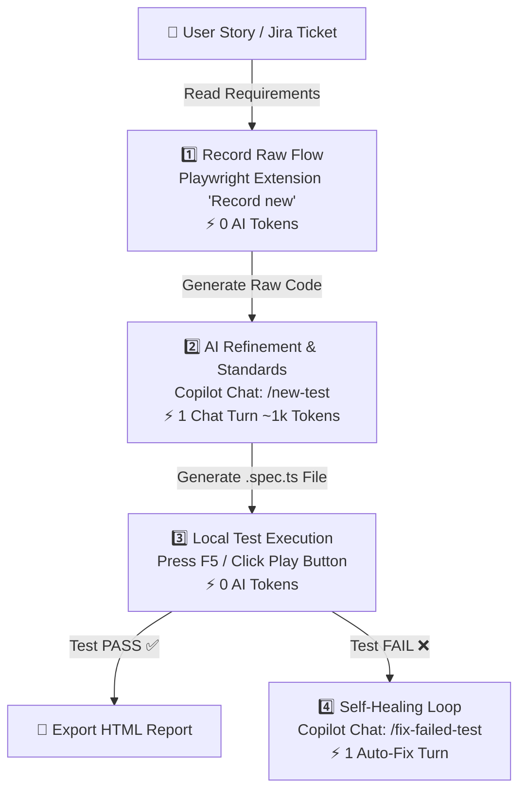

# 📋 QA TESTING OPTIMIZATION PLAN & 1-CLICK WORKFLOW FOR TESTERS
### (VSCode + GitHub Copilot + Playwright Automation — >95% Token Savings)

---

## 📌 1. Background & Current Problem

### 1.1. Current Workflow
The QA/Tester team currently uses **VSCode + GitHub Copilot** integrated with the **MCP Playwright Testing Server** (Model Context Protocol) to read User Stories from Jira, generate test scenarios, and execute automated UI tests directly on web interfaces.

### 1.2. Core Bottlenecks (Token Burn & Quota Exhaustion)
| Bottleneck | Token Consumption Mechanism | Consequences |
|---|---|---|
| **Full Page DOM Dumps** | Every single action (click, input, hover) via MCP injects the entire DOM / HTML / Accessibility Tree (10k – 40k tokens per call). | Rapidly hits Rate Limits and exhausts model quota. |
| **Multi-Turn Trial & Error** | Copilot operates step-by-step, misses selectors, and retries 5–10 turns consecutively through MCP. | Token cost multiplies exponentially for a single test case. |
| **Context Accumulation** | Chat history retains old DOM snapshots across turns and resends them in every subsequent message. | Context window bloat, degrading AI speed and accuracy. |

---

## 🎯 2. Plan Objectives

1. **Reduce Token Cost by >95%:** Transition from *"AI step-by-step execution via MCP"* to *"1-turn AI script generation + local Playwright Engine execution"*.
2. **Simplify Tester Experience (1-Click Workflow):** Testers do not need advanced coding knowledge or terminal commands—everything is performed through the intuitive VSCode UI.
3. **10x Execution Speedup:** Tests run locally in milliseconds with rich visual reporting (HTML Report & Trace Viewer).

---

## 🏗️ 3. Optimized Workflow Architecture (Adaptive 3-Step Workflow)



---

## 🛠️ 4. Toolset & Pre-configured VSCode Environment

The system standardizes pre-built configuration files ready for immediate use by Testers:

### 4.1. Recommended Extensions (`.vscode/extensions.json`)
```json
{
  "recommendations": [
    "ms-playwright.playwright",
    "github.copilot",
    "github.copilot-chat"
  ]
}
```
- **Playwright Test for VSCode (Microsoft):** Provides a 1-click graphical interface inside the Testing tab (flask icon 🧪) with key buttons:
  - 🔴 **Record new:** Automatically opens a browser; code is generated in real-time as the Tester clicks.
  - 🎯 **Pick locator:** Hover over web elements to extract the most resilient selector.
  - 🟢 **Run / Debug Test:** Run individual test cases directly with a single Play button.

### 4.2. Automation Shortcuts (`.vscode/tasks.json`)
Pre-configured shortcut **`F5`** or **`Ctrl + Shift + B`** to trigger quick actions:
1. **1-Click: Run Playwright E2E Tests:** Automatically executes the complete E2E test suite.
2. **1-Click: Record New Test (Codegen):** Launches the browser recorder for user flows.
3. **1-Click: Show Last HTML Report:** Opens the interactive test report in the default browser.

### 4.3. Slash Command Prompt Suite (`.github/prompts/`)
- **`/new-test` (`.github/prompts/new-test.prompt.md`):**
  - Testers simply paste the User Story description or raw recorded snippet.
  - Copilot automatically converts it into a clean **Page Object Model (POM)** spec file with robust assertions and comments.
- **`/fix-failed-test` (`.github/prompts/fix-failed-test.prompt.md`):**
  - When a test fails, Testers paste the failure log.
  - Copilot diagnoses the root cause (Real Web Bug vs UI Selector Drift) and provides an instant fix.

---

## 📖 5. Step-by-Step Guide for Testers

### Step 1: Record Business Flow (0 Tokens)
1. Open VSCode and switch to the 🧪 **Testing** tab on the left sidebar.
2. Click **Record new test** (or press `Ctrl+Shift+P` and choose `Playwright: Record new test`).
3. The browser will open automatically; perform the user actions: Login $\rightarrow$ Fill form $\rightarrow$ Click button $\rightarrow$ Verify message.
4. Close the browser; the raw code is generated directly in VSCode.

### Step 2: Refine & Add Assertions via Copilot (~1k Tokens)
1. Open **GitHub Copilot Chat** (`Ctrl + Alt + I`).
2. Type the prompt:
   ```text
   /new-test
   - User Story: Log in to the system and verify Dashboard display
   - Recorded snippet: <Paste code from Step 1 here>
   - Expected outcome: Display username "Ngoc Anh" and "Log out" button
   ```
3. Copilot will output a production-grade test file `tests/e2e/login.spec.ts` with structured checks and `expect(...)` assertions.

### Step 3: Run Tests & View Reports (0 Tokens)
1. Press **`F5`** (or click the green Play button next to the test item).
2. The test runs locally within seconds:
   - ✅ **Green:** Test passed, feature operates as expected.
   - ❌ **Red:** Test failed.
3. If failed $\rightarrow$ Copy the error trace, open Copilot Chat, and type:
   ```text
   /fix-failed-test <Paste error log here>
   ```
   Copilot will explain the failure reason and update the locators accordingly.

---

## 📊 6. Performance Comparison (Before vs After Optimization)

| Criteria | Legacy MCP Playwright Approach | New 1-Click Workflow | Improvement |
|---|---|---|---|
| **Token Cost / Test Case** | $30,000$ – $100,000$ tokens | $\approx 1,000$ tokens | **~97% Token Reduction** 💰 |
| **Execution Time per Scenario** | 2 – 5 minutes (waiting for tool calls) | 3 – 10 seconds (Playwright Engine) | **20x Faster Execution** ⚡ |
| **Reliability** | Prone to API throttling and mis-clicks | 100% deterministic (Local Engine) | **Eliminates Flakiness & Interruptions** 🎯 |
| **Tester Skill Requirement** | Requires prompt tuning and MCP setup | Point-and-click inside VSCode UI | **Accessible for All Testers** 👥 |
| **CI/CD Integration** | Difficult to automate in pipelines | Runs natively via `npx playwright test` | **Ready for GitHub Actions / Jenkins** 🚀 |

---

## 🚀 7. Team Rollout Roadmap

1. **Phase 1 (Initial Setup - One-time):**
   - Initialize Node.js & Playwright in repository: `npm init playwright@latest`.
   - Install `Playwright Test for VSCode` extension on all QA machines.
2. **Phase 2 (Pilot Sprint - 1 Sprint):**
   - Onboard Testers on `/new-test` and `/fix-failed-test` slash commands.
   - Convert 5–10 critical User Stories into automated Playwright E2E suites.
3. **Phase 3 (Full Adoption):**
   - Centralize all test suites in the repository and automate execution on every Pull Request.
