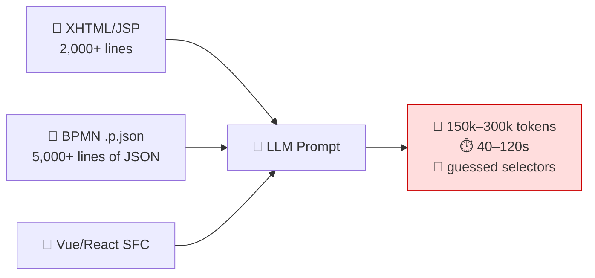
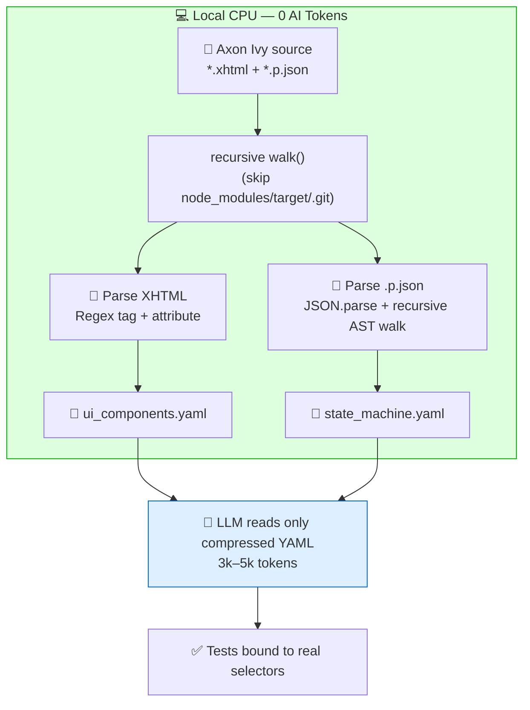
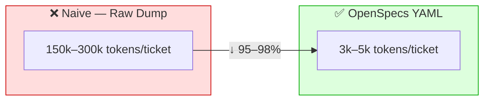
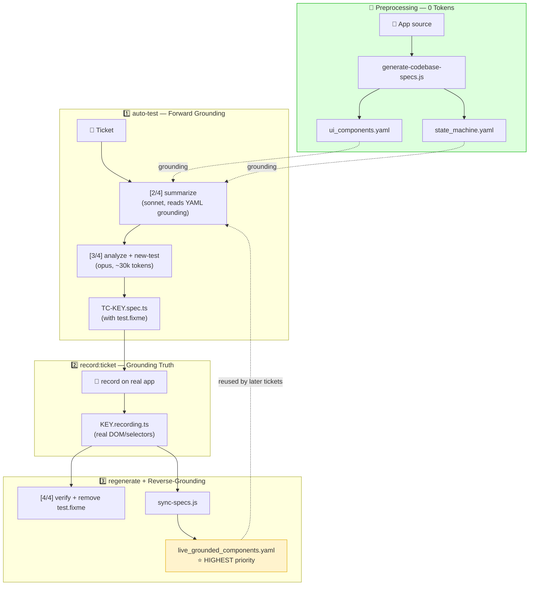

# 🏛️ OpenSpecs YAML Architecture — Why Compressing a Codebase into YAML Is Faster, Lighter & Token-Efficient

> **Enterprise architecture whitepaper — for engineering teams, leadership, and client stakeholders.**
> Explains how we statically extract application source code (XHTML / BPMN `.p.json`) into compact YAML specifications (`ui_components.yaml`, `state_machine.yaml`) so GitHub Copilot can *ground* against real UI/business logic with ~100% accuracy — instead of dumping raw source into the LLM.
>
> Applied on the **QA-Playwright-ASAP** project (Axon Ivy + PrimeFaces/JSF).

---

## 📑 Table of Contents

1. [Executive Summary](#1-executive-summary)
2. [The Problem: Dumping Raw Source into an LLM Is Expensive & Inaccurate](#2-the-problem-dumping-raw-source-into-an-llm-is-expensive--inaccurate)
3. [The Solution: Zero-Token Preprocessing (Static Extraction on Local CPU)](#3-the-solution-zero-token-preprocessing-static-extraction-on-local-cpu)
4. [`ui_components.yaml` Structure](#4-ui_componentsyaml-structure)
5. [`state_machine.yaml` Structure](#5-state_machineyaml-structure)
6. [Why YAML Beats JSON & Raw Code](#6-why-yaml-beats-json--raw-code)
7. [Benchmark & Token Economics](#7-benchmark--token-economics)
8. [Role in the 3-Step Grounding & Reverse-Grounding Workflow](#8-role-in-the-3-step-grounding--reverse-grounding-workflow)
9. [Conclusion](#9-conclusion)

---

## 1. Executive Summary

| Metric | Naive Raw Source Dump | OpenSpecs YAML (this architecture) | Improvement |
| --- | --- | --- | --- |
| **Input tokens / ticket** | 150,000 – 300,000 tokens | 3,000 – 5,000 tokens | **↓ 95 – 98%** |
| **AI cost / ticket** | ~$2.00 – $4.00 | ~$0.03 – $0.05 | **↓ ~98%** |
| **Latency** | 40 – 120 s (multi-turn) | 3 – 8 s (single turn) | **~10 – 20× faster** |
| **Selector hallucination risk** | High (AI guesses the DOM) | Near zero (real grounding) | **Eliminated** |
| **Context-window overflow** | Frequent (>128k) | Never | **100% safe** |

> **Core idea:** an LLM **does not need to read the entire codebase** to understand the application. We use **local CPU (0 AI tokens)** to extract *only the knowledge that matters* — component ids, labels, roles, transitions — and compress it into semantically dense YAML. The LLM reads only that compressed digest.

---

## 2. The Problem: Dumping Raw Source into an LLM Is Expensive & Inaccurate

The naive approach to making AI generate tests for a screen: **paste the entire XHTML/JSP/Vue/React file plus the BPMN `.p.json` into the prompt.**

### 2.1. Three bottlenecks



| Bottleneck | Token-burn mechanism | Consequence |
| --- | --- | --- |
| **Full Source Dump** | Each screen = thousands of lines of markup + EL bindings + CSS + comments meaningless to the AI. | Hits rate limits, burns model quota. |
| **Syntax noise** | 60–80% of characters are `<div>`, `</div>`, `"`, `{`, `}`, style attributes — **no business semantics**. | Very low token-to-semantic ratio → you pay for noise. |
| **Multi-turn trial & error** | AI guesses a wrong selector → test fails → resends the DOM → repeats 5–10 turns. | Tokens multiply exponentially for a single test case. |

### 2.2. Why the AI hallucinates

Fed 300k tokens of raw markup, the LLM must **infer** which is the real `id` of the "Save" button, which fields are required, which role can see the screen. Result: it **fabricates** `getByRole('button', { name: 'Save' })` while the real id is `form:saveBtn` — the test **fails on the first run** (see `docs/ROOT_CAUSE_ANALYSIS_TESTCASE_VS_PROMPT.md`, root cause R1).

---

## 3. The Solution: Zero-Token Preprocessing (Static Extraction on Local CPU)

Instead of burning the LLM's context window to "read" the source, we move comprehension to **local CPU via static analysis (AST / Regex)** — **0 AI tokens**.

`scripts/generate-codebase-specs.js` scans the source **READ-ONLY** and extracts:



### 3.1. XHTML extraction — Regex over tags/attributes

The script walks known PrimeFaces/JSF tags and maps them to a normalized component type:

```js
// scripts/generate-codebase-specs.js
const COMPONENT_TAG_MAP = {
  'p:selectBooleanCheckbox': 'selectBooleanCheckbox',
  'p:inputText': 'inputText',
  'p:commandButton': 'commandButton',
  'p:selectOneMenu': 'selectOneMenu',
  'p:calendar': 'datePicker',
  // ...
};
```

For each matching tag it extracts **only what the AI needs**: `id`, `type`, `label` (preferring `ivy.cms.co('/path')` → a short CMS key), `valueBinding`, `actionBinding`, `rendered`, and **infers `required`** by scanning the next 400 characters for `requiredCheckboxValidator` / `required="true"`.

> **Key point:** 2,000 lines of XHTML → a few dozen lines of YAML carrying **exactly the business semantics**, discarding all layout/CSS/comments.

### 3.2. BPMN `.p.json` extraction — recursive AST walk

Axon Ivy processes nest via `EmbeddedProcessGroup` / `SubProcess`. `collectProcessElements()` **recursively walks the entire JSON tree** (a form of AST walking) to collect:

- **`UserTask`** → `id`, `name`, `dialog`, `responsibleRole` (decoding `ROLE_FROM_ATTRIBUTE(...)`).
- **`Alternative`** → transition + **branching conditions** (`conditions`).
- **`roles`** → the set of every role appearing in the process.

```js
if (el && el.type === 'UserTask') {
  tasks.push({
    id: el.id,
    name: rawName,
    dialog: (el.config && el.config.dialog) || null,
    responsibleRole   // ← already decoded from ROLE_FROM_ATTRIBUTE
  });
} else if (el && el.type === 'Alternative') {
  transitions.push({ id: el.id, name: el.name, conditions });
}
// recurse deeper to capture nested SubProcesses
collectProcessElements(el, tasks, transitions, roles);
```

> **Not a single AI token is spent** in this whole step. This is the **most expensive** work (understanding the codebase) but the **cheapest in cost** — because it runs on CPU, not on the LLM vendor's GPUs.

---

## 4. `ui_components.yaml` Structure

The static UI spec: **each dialog/screen → a list of components**, with everything needed to ground a locator.

### 4.1. Structure diagram

```
ui_components.yaml
├── generatedAt          # ISO timestamp of generation
├── source               # scanned source path (READ-ONLY)
├── dialogCount          # total dialogs
├── componentCount       # total components
└── dialogs[]
    ├── name             # dialog name (= .xhtml file name)
    ├── path             # relative path in the source
    ├── componentCount
    └── components[]
        ├── id           # ⭐ real id used to build the selector (form:saveBtn)
        ├── type         # normalized type (inputText, commandButton...)
        ├── tag          # original tag (p:inputText)
        ├── label        # display label / CMS key
        ├── valueBinding # EL binding (#{bean.field})
        ├── actionBinding# action/actionListener
        ├── rendered     # visibility condition (if any)
        ├── required     # ⭐ required? (inferred from validator)
        └── styleClass
```

### 4.2. Real-world example

```yaml
generatedAt: '2026-09-08T07:30:00.000Z'
source: D:\Projects\asap
dialogCount: 42
componentCount: 318
dialogs:
  - name: DeviceRegistrationDialog
    path: processes/Device/DeviceRegistrationDialog.xhtml
    componentCount: 4
    components:
      - id: form:stationNumber
        type: inputText
        tag: p:inputText
        label: /Dialogs/Device/StationNumber
        valueBinding: '#{data.device.stationNumber}'
        actionBinding: null
        rendered: null
        required: true
        styleClass: w-full
      - id: form:transformerCheckbox
        type: selectBooleanCheckbox
        tag: p:selectBooleanCheckbox
        label: nsTransformerMeasurementAvailable
        valueBinding: '#{data.device.nsTransformerMeasurementAvailable}'
        required: false
      - id: form:saveButton
        type: commandButton
        tag: p:commandButton
        label: /Buttons/Save
        actionBinding: '#{logic.save}'
        required: false
```

> From this YAML, Copilot knows for certain the Save button id is `form:saveButton` and `stationNumber` is **required** → it generates a correct test on the first try, no guessing.

---

## 5. `state_machine.yaml` Structure

The business-flow (BPMN) spec: **each process → tasks, responsible roles, transitions + branching conditions.**

### 5.1. Structure diagram

```
state_machine.yaml
├── generatedAt
├── source
├── processCount
├── taskCount
├── transitionCount
├── roles[]              # aggregate of every role system-wide
└── processes[]
    ├── name
    ├── path
    ├── dataClass        # data class bound to the process
    ├── taskCount
    ├── transitionCount
    ├── tasks[]
    │   ├── id
    │   ├── name
    │   ├── dialog       # dialog bound to the task
    │   ├── taskNameExpr
    │   └── responsibleRole  # ⭐ who may operate this task
    ├── transitions[]
    │   ├── id
    │   ├── name
    │   └── conditions   # ⭐ branching condition (IvyScript)
    └── roles[]
```

### 5.2. Real-world example

```yaml
generatedAt: '2026-09-08T07:30:00.000Z'
source: D:\Projects\asap
processCount: 12
taskCount: 47
transitionCount: 63
roles:
  - AssetManager
  - FieldTechnician
  - Reviewer
processes:
  - name: DeviceCommissioning
    path: processes/Device/DeviceCommissioning.p.json
    dataClass: com.asap.device.CommissioningData
    taskCount: 3
    transitionCount: 4
    tasks:
      - id: 15D2A1F0B3
        name: Enter device data
        dialog: DeviceRegistrationDialog
        taskNameExpr: /Tasks/EnterDeviceData
        responsibleRole: FieldTechnician
      - id: 15D2A1F0C7
        name: Review & approve
        dialog: DeviceReviewDialog
        responsibleRole: Reviewer
    transitions:
      - id: 15D2A1F0D9
        name: Approved?
        conditions: 'in.device.status == "READY"'
    roles:
      - FieldTechnician
      - Reviewer
```

> Copilot uses this file to know that the "Review & approve" task can be operated **only by Reviewer**, and that the Approved branch fires when `status == "READY"` → it generates tests with the correct role and the correct condition.

---

## 6. Why YAML Beats JSON & Raw Code

For the same semantics, the three formats consume **very different** amounts of tokens. The reason: **semantic density per token** (token-to-semantic ratio).

### 6.1. Same component, three formats

**❌ Raw XHTML (~55 tokens, full of noise):**
```xml
<p:inputText id="stationNumber" value="#{data.device.stationNumber}"
             styleClass="w-full" required="true"
             requiredMessage="#{msg['error.required']}">
  <p:ajax event="blur" update="@this" />
</p:inputText>
```

**🟡 JSON (~38 tokens, heavy on braces/quotes):**
```json
{ "id": "form:stationNumber", "type": "inputText", "required": true, "label": "StationNumber" }
```

**✅ YAML (~22 tokens, hierarchy via indentation):**
```yaml
- id: form:stationNumber
  type: inputText
  required: true
  label: StationNumber
```

### 6.2. Format comparison

| Criterion | Raw Code (app XHTML/JSON) | JSON | **YAML (chosen)** |
| --- | --- | --- | --- |
| **Syntax noise** | Very high (`<>`, CSS, ajax, comments) | Medium (`{}`, `"`, `,`) | **Lowest (indentation)** |
| **Redundant chars/tokens** | `<div></div>`, double quotes | `{`, `}`, `"key":`, `,` | Almost none (just `-` and `:`) |
| **Hierarchy representation** | Verbose nested tags | Nested braces | **Natural indentation** |
| **Semantic density** | Low (20–40%) | Medium (~60%) | **Highest (~90%)** |
| **Easy for LLM to read?** | Hard (must strip noise) | OK | **Very easy (heavily trained)** |
| **Tokens for same data** | 100% (baseline) | ~65% | **~40%** |

### 6.3. Why indentation saves tokens

- JSON repeats `"`, `{`, `}`, `,` at **every** key → each of these characters is often a **separate token**.
- YAML replaces all of that with **indentation (whitespace)** + `key:` — tokenizers merge whitespace far more efficiently than braces/quotes strings.
- Net result: for the same content, YAML typically costs **~60% of JSON's tokens** and **~40% of raw code's tokens**.

---

## 7. Benchmark & Token Economics

### 7.1. Token consumption per ticket



| Item | Naive (Raw Dump) | OpenSpecs YAML | Savings |
| --- | ---: | ---: | ---: |
| Input tokens / ticket | 150,000 – 300,000 | 3,000 – 5,000 | **95 – 98%** |
| Interaction turns | 5 – 10 (trial/error) | 1 (one-shot) | **~90%** |
| End-to-end latency | 40 – 120 s | 3 – 8 s | **~10–20×** |
| AI cost / ticket | **$2.00 – $4.00** | **$0.03 – $0.05** | **~98%** |
| Risk of exceeding 128k context | High | None | Eliminated |
| Selector hallucination | Frequent | Near zero | Eliminated |

### 7.2. Economics at team scale

Assume the team processes **500 tickets/month**:

| Scenario | Cost/ticket | Cost/month | Cost/year |
| --- | ---: | ---: | ---: |
| Naive Raw Dump | $3.00 | **$1,500** | **$18,000** |
| OpenSpecs YAML | $0.04 | **$20** | **$240** |
| **Savings** | | **$1,480/month** | **≈ $17,760/year** |

> The YAML extraction cost is **one-time** (`npm run generate-codebase-specs`, 0 AI tokens) and only re-runs when the codebase changes. The "expensive" part is paid in **~seconds of local CPU**, not in LLM tokens repeated per ticket.

### 7.3. Context-window limits

- Common models: 128k – 200k token context. A complex ticket with several XHTML files + a `.p.json` **easily exceeds** this → it simply **won't fit**.
- YAML compresses a full screen + business flow down to **3–5k tokens** → it **always fits**, leaving ample room for reasoning, images, and comments.

---

## 8. Role in the 3-Step Grounding & Reverse-Grounding Workflow

OpenSpecs YAML is the **grounding foundation** of the entire `npm run auto-test` pipeline.



### The three standard QA steps

| Step | Command | Role of YAML |
| :-: | --- | --- |
| **1️⃣ Generate** | `npm run auto-test <KEY>` | `ui_components.yaml` + `state_machine.yaml` are the **grounding source** for `/summarize-story` and `/new-test` → the AI never guesses selectors/roles. |
| **2️⃣ Record** | `npm run record:ticket <KEY>` | The tester clicks the real flow → exports a recording (Grounding Truth, higher priority than static specs). |
| **3️⃣ Regenerate** | `npm run regenerate <KEY>` | Spec binds to real selectors, removes `test.fixme`; **Reverse-Grounding** merges the verified selectors back into `live_grounded_components.yaml` so **later tickets reuse them instantly**. |

### Grounding vs Reverse-Grounding

- **Forward (Grounding):** OpenSpecs YAML → generate tests. The AI pulls ids/labels/roles from the spec, no fabrication.
- **Reverse-Grounding:** the selectors the tester just exercised on the real app → `sync-specs.js` extracts them (`getByRole`, `getByLabel`, naming-container client ids such as `form:saveButton`...) → writes them into `live_grounded_components.yaml` with `origin: live_recording_<KEY>`. This file has **the highest priority** because it is the real DOM just observed → the spec set **self-learns and accumulates living knowledge**.

---

## 9. Conclusion

> **The principle:** *"Don't make the LLM read the whole codebase. Use local CPU (0 tokens) to extract exactly the knowledge you need, compress it into semantically dense YAML, and hand the LLM only that digest."*

The OpenSpecs YAML architecture delivers **three usually-conflicting benefits at once**:

1. **💰 Cheap:** ↓ 95–98% tokens → ~$0.04/ticket instead of ~$3.00.
2. **⚡ Fast:** one-shot 3–8s instead of multi-turn 40–120s.
3. **🎯 Accurate:** grounded in the real DOM/BPMN → eliminates selector hallucination, tests pass on the first run.

This is the shift from *"AI re-reads raw source every time"* to *"static preprocessing once + AI reasons over the digest"* — a model that stays sustainable at a scale of hundreds of tickets per month.

---

### 🔗 Related documentation

- [`docs/en/README.md`](./README.md) — 3-step Quick Start (English).
- [`docs/en/ADVANCED-GUIDE.md`](./ADVANCED-GUIDE.md) — advanced mechanics (English).
- [`docs/QA_PLAYWRIGHT_OPTIMIZATION_PLAN_EN.md`](../QA_PLAYWRIGHT_OPTIMIZATION_PLAN_EN.md) — token-optimization plan.
- [`scripts/generate-codebase-specs.js`](../../scripts/generate-codebase-specs.js) — the extractor.
- 🇻🇳 Vietnamese version: [`docs/CODEBASE_YAML_SPECS_ARCHITECTURE.md`](../CODEBASE_YAML_SPECS_ARCHITECTURE.md)
